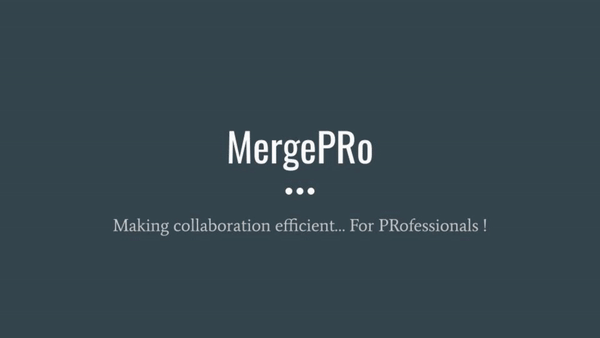

# MergePRo
MergePRo - A collaboration tool for developers to manage their codebase and Pull Requests efficiently.

## How to install

1. Install the [Chrome extension]

( )

2. [Create a GitHub personal access token with the **repo** permission](https://github.com/settings/tokens)
3. Enter the token into the extension
4. Enjoy

## DEMO LINK
<a href="https://www.youtube.com/watch?v=fSRa-JaeOvE&feature=youtu.be&ab_channel=AbhinavSingh"> MERGE PRO</a>
[PLEASE ON THE SUBTITLES]

## How to build it yourself

If you don't trust a random browser extension on the Internet with your GitHub token, that's understandable.

Here's how to build the extension yourself from source:

1. Install [Npm](https://www.npmjs.com/).
2. Install dependencies with `npm install`.
3. Run `npm run build` for Mac/Linux and `npm run build-windows` for Windows.
4. In Chrome, go to chrome://extensions and enable "Developer mode" in the top-right corner.
5. Click "Load unpacked" and select the generated `dist/` directory.
